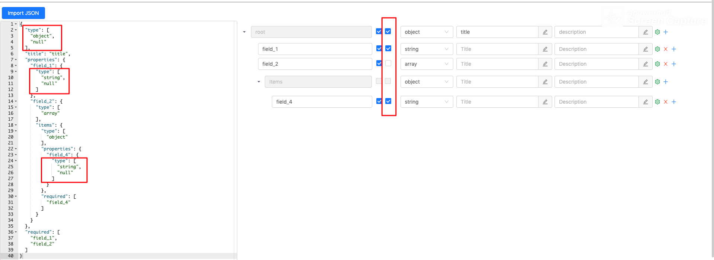

# json-schema-editor-visual
A json-schema editor of high efficient and easy-to-use, base on React.



## Fork
功能：添加“是否可为null”的CheckBox，设置类型是否可为null（如上图，红框）

代码层面：type字段类型改为Array，因为可能需要表示两个类型——null和其他类型
## Usage
```
npm install json-schema-editor-visual
```

```js
const option = {}
import 'antd/dist/antd.css'
require('json-schema-editor-visual/dist/main.css')
const schemaEditor = require("json-schema-editor-visual/dist/main.js");
const SchemaEditor = schemaEditor(option)

render(
    <SchemaEditor />,
  document.getElementById('root')
)
```

## Option Object

| name | desc | default |
| ---- | ----------- | --------- |
| `lg` | language, support `en_US` or `zh_CN` | en_US 

## SchemaEditor Props

| name | type | default | desc
| ---- | ----------- | --------- | --------- |
| `data` | string | null | the data of editor
| `onChange`| function | null | 
| `showEditor` | boolean | false | 

## Links
https://github.com/zyqwst/json-schema-editor-vue
